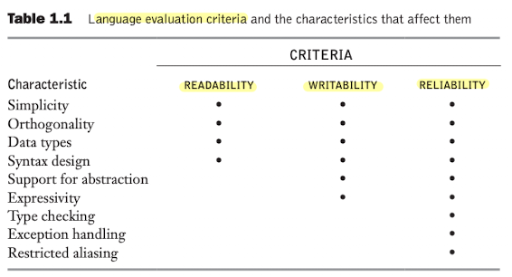
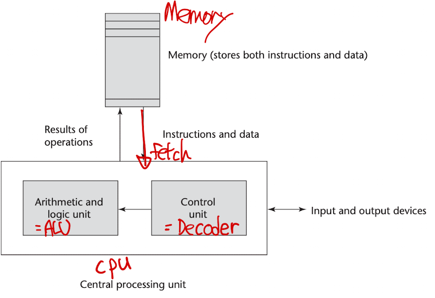
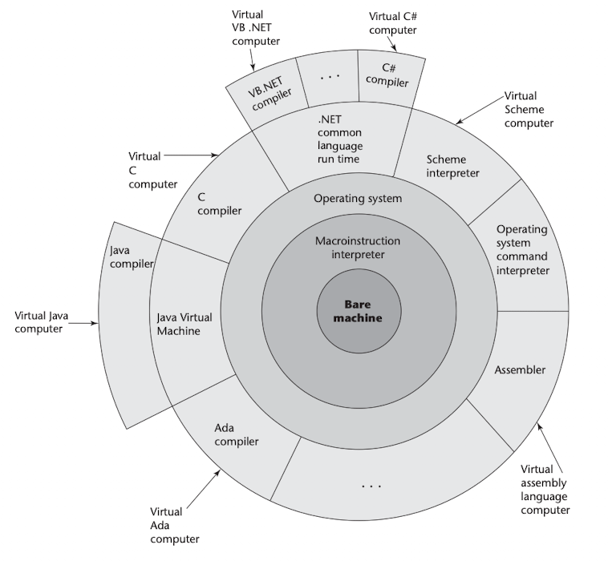
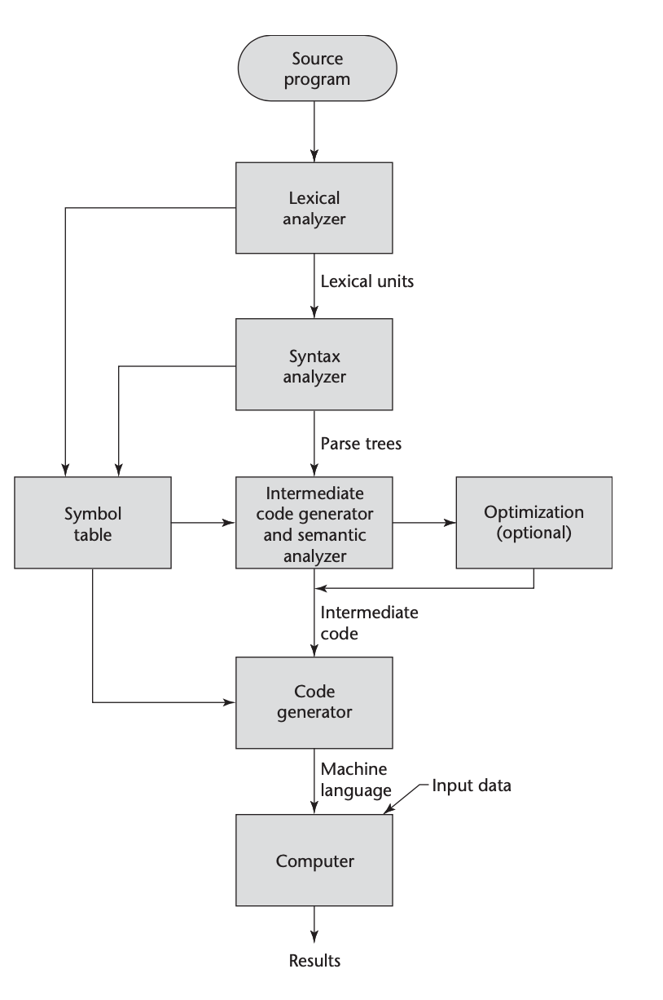
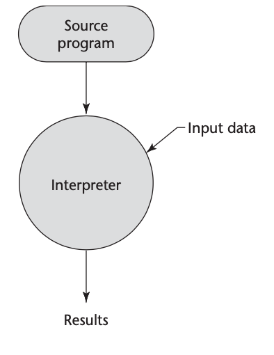
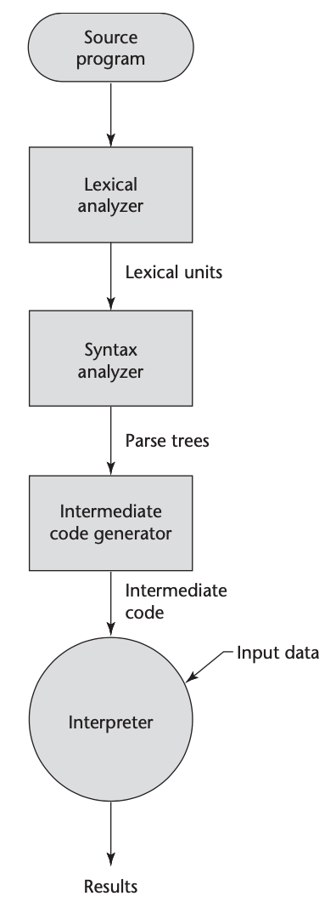

<!--
1. 이미지(가운데 정렬, 60%)
<p align = "center"></p>
<p align = "center">
내용
</p>

-->
# Chapter 1. Preliminaries
## Subtopics
- [1.1 Reasons for Studying Concepts of P.L](#1.1-Reasons-for-Studying-Concepts-of-P.L)
- [1.2 Programming Domains](#1.2-Programming-Domains)
- [1.3 Language Evaluation Criteria](#1.3-Language-Evaluation-Criteria)
- [1.4 Influences on Language Design](#1.4-Influences-on-Language-Design)
- [1.5 Language Categories](#1.5-Language-Categories)
- [1.6 Language Design Trade-Offs](#1.6-Language-Design-Trade-Offs)
- [1.7 Implementation Methods](#1.7-Implementation-Methods)
- [1.8 Programming Environments](#1.8-Programming-Environments)

***
# 1.1 Reasons for Studying Concepts of P.L
- 아이디어를 표현하는 능력을 기를 수 있다
- 적절한 언어를 고르기 위한 배경 지식을 향상 시킬 수 있다
- 새로운 언어를 배우기 위한 능력을 기를 수 있다
***
# 1.2 Programming Domains
- 컴퓨터는 무수히 많은 영역에 적용된다, 이러한 컴퓨터의 특징으로 인해<br>
프로그래밍언어 역시 다양한 목적을 갖고 발전해 왔다

#### 1.2.1 Scientific Applications
#### 1.2.2 Business Applications
#### 1.2.3 Artificial Intelligence
#### 1.2.4 Web Software

- 본 교재에서는 간단하게 위 4가지 영역에서 프로그래밍 도메인을 구분했다
***
# 1.3 Language Evaluation Criteria
 
<p align = "center"></p>
<p align = "center">
Table 1.1
</p>

- 언어 평가 기준과 그 특징들
***
## 1.3.4 Cost
- 프로그래밍 언어의 `The total cost`는 다양한 특징을 가진다
	1. 언어를 사용하기 위해 프로그래머들이 연습하는데 드는 cost
	2. 언어로 프로그램을 작성하는데 드는 cost
	3. 언어로 컴파일링 하는데 드는 cost
	4. 언어로 쓰여진 프로그램을 실행하는데 드는 cost
***
# 1.4 Influences on Language Design
## 1.4.1 Computer Architecture
- 가장 기초적인 컴퓨터 구조는 `von Neumann architecture`이다
<br>이 언어는 `imperative`(명령형) 언어라고 불린다

<p align = "center"></p>
<p align = "center">
Figure 1.1 폰 노이만 컴퓨터 구조
</p>

- 폰 노이만 구조에서 컴퓨터는 `fetch-execute cycle`이라는 프로세스를 발생시킨다
<br>-> 메모리에 위치한 프로그램이지만, CPU에 의해 실행된다

- 각각의 instruction은 메모리에서 프로세서로 이동해야만 한다
- 다음 실행될 instruction의 주소는 `program counter`라고 불리는 레지스터에 위치해 있다

- `fetch-execute cyle`알고리즘은 다음과 같다
```
initialize the program counter

repeat forever
	fetch the instruction pointed to by the program counter
	increment the program counter to point at the next instruction
	decode the instruction
	execute the instruction
end repeat
```
***
## 1.4.2 Programming Design Methodologies
- 1960년 후반부터 70년대 초에 `the structured-programming`에 대한 움직임이 생겨났다
- 1980년 초반에는 `object-oriented design`이 생겨나기 시작했다
- OOP는 `Smalltalk`언어로 부터 영향을 받았다
- 또한 이 개념은`imperative languages`들에게도 많은 영향을 끼쳤다
***
# 1.5 Language Categories
- 본 교재는 4가지로 언어를 구분했다 :
	- imperative
	- functional
	- logic
	- object oriented
- 최근에는 새로운 카테고리의 언어가 등장했다 ->	`markup/programming hybrid languages`
- `Markup languages` 는 프로그래밍 언어가 아니다
-  ex)  `HTML` 
***
# 1.6 Language Design Trade-Offs
- `reliability` VS `cost of execution`
- `C`의 경우 `reliability`는 높진 않지만 실행 속도가 빠르다
- 반대로 `JAVA`의 경우 실행 속도는 느리지만 `reliability`를 보장 할 수 있다
***
# 1.7 Implementation Methods
- High Level Language를 변환하는 법
	1. compiler
	1. Interpreter
	1. Hybrid
***
## 1.7.1 Compilation
<p align = "center"></p>
<p align = "center">
Figure 1.2
</p>

<p align = "center"></p>
<p align = "center">
Figure 1.3 The compliation process
</p>

***
## 1.7.2 Pure Interpretation
- 프로그램들은 Interpreter라고 불리는 프로그램에 의해 번역된다
- `Interpreter` 프로그램들은 `fetch-execute`처럼 행동한다
- `Pure interpretation`은 많은 source-level 디버깅 하기에 쉽다는 장점이 있다

<p align = "center"></p>
<p align = "center">
Figure 1.4 Pure Interpretation
</p>

## 1.7.3 Hybrid Implementation System
- 이 방법은 `pure interpretation`방식보다 빠르다<br>
-> the source language statements가 한번만 해독되기 때문에..
- `Portablilty`한 성격을 가지고 있다
- ex) Java Virtual Machine

<p align = "center"></p>
<p align = "center">
Figure 1.5 Hybrid implementation system
</p>

***
# 1.8 Programming Environments
- 프로그래밍 환경은 소프트웨어 개발에 사용되는 여러 도구(tools)들의 모음(collection)이다
- 이 모음(collection)은 파일 시스템, 텍스트 에디터, 링커, 컴파일러들로 구성된다
***
